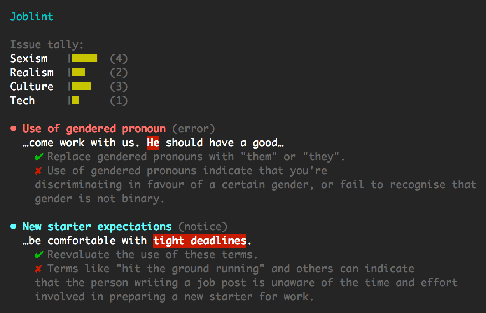

Joblint
=======

Test tech job posts for issues with sexism, culture, expectations, and recruiter fails.

**Writing a job post?** Use Joblint to make your job attractive to a much broader range of candidates and ensure you're not being discriminatory.  
**Getting swamped in job posts?** Use Joblint to filter out the bad ones.

[![NPM version][shield-npm]][info-npm]
[![Node.js version support][shield-node]][info-node]
[![Build status][shield-build]][info-build]
[![Dependencies][shield-dependencies]][info-dependencies]
[![MIT licensed][shield-license]][info-license]

```sh
joblint path/to/job-post.txt
```




Table Of Contents
-----------------

- [Command-Line Interface](#command-line-interface)
- [JavaScript Interface](#javascript-interface)
- [Configuration](#configuration)
- [Writing Rules](#writing-rules)
- [Examples](#examples)
- [Contributing](#contributing)
- [Thanks](#thanks)
- [License](#license)


Command-Line Interface
----------------------

Install Joblint globally with [npm][npm]:

```sh
npm install -g joblint
```

This installs the `joblint` command-line tool:

```
  Usage: joblint [options] <path>

  Options:

    -h, --help                 output usage information
    -V, --version              output the version number
    -r, --reporter <reporter>  the reporter to use: cli (default), json
    -l, --level <level>        the level of message to fail on (exit with code 1): error, warning, notice
    -p, --pretty               output pretty JSON when using the json reporter
```

Run Joblint against a text file:

```sh
joblint path/to/job-post.txt
```

Run Joblint against a text file and output JSON results to another file:

```sh
joblint --reporter json path/to/job-post.txt > report.json
```

Run Joblint against piped-in input:

```sh
echo "This is a job post" | joblint
```

Run Joblint against the clipboard contents:

```sh
# OS X
pbpaste | joblint

# Linux (with xclip installed)
xclip -o | joblint
```

### Exit Codes

The command-line tool uses the following exit codes:

  - `0`: joblint ran successfully, and there are no errors
  - `1`: there are errors in the job post

By default, only issues with a type of `error` will exit with a code of `1`. This is configurable with the `--level` flag which can be set to one of the following:

  - `error`: exit with a code of `1` on errors only, exit with a code of `0` on warnings and notices
  - `warning`: exit with a code of `1` on errors and warnings, exit with a code of `0` on notices
  - `notice`: exit with a code of `1` on errors, warnings, and notices
  - `none`: always exit with a code of `0`

### Reporters

The command-line tool can report results in a few different ways using the `--reporter` flag. The built-in reporters are:

  - `cli`: output results in a human-readable format
  - `json`: output results as a JSON object

You can also write and publish your own reporters. Joblint looks for reporters in the core library, your `node_modules` folder, and the current working directory. The first reporter found will be loaded. So with this command:

```
joblint --reporter foo path/to/job-post.txt
```

The following locations will be checked:

```
<joblint-core>/reporter/foo
<cwd>/node_modules/foo
<cwd>/foo
```

A joblint reporter should export a single function which accepts two arguments:

  - The test results as an object
  - The [Commander][commander] program with all its options


JavaScript Interface
--------------------

Joblint can run in either a web browser or Node.js. The supported versions are:

  - Node.js 0.10.x, 0.12.x, 4.x, 5.x
  - Android Browser 2.2+
  - Edge 0.11+
  - Firefox 26+
  - Google Chrome 14+
  - Internet Explorer 9+
  - Safari 5+
  - Safari iOS 4+

### Node.js

Install Joblint with [npm][npm] or add to your `package.json`:

```
npm install joblint
```

Require Joblint:

```js
var joblint = require('joblint');
```

### Browser

Include the built version of Joblint in your page (found in [built/joblint.js](build/joblint.js)):

```html
<script src="joblint.js"></script>
```

### Browser (Bower)

Install Joblint with [Bower][bower] or add to your `bower.json`:

```
bower install joblint
```

### Running

Run Joblint on a string:

```js
var results = joblint('This is a job post');
```

The `results` object that gets returned looks like this:

```js
{

    // A count of different issue types
    counts: {
        foo: Number
    },

    // A list of issues with the job post
    issues: [

        {
            name: String, // Short name for the rule that was triggered
            reason: String, // A longer description of why this rule was triggered
            solution: String, // A short description of how to solve this issue
            level: String, // error, warning, or notice
            increment: {
                foo: Number // The amount that each count has been incremented
            },
            occurance: String, // The exact occurance of the trigger
            position: Number, // The position of the trigger in the input text
            context: String // The text directly around the trigger with the trigger replaced by "{{occurance}}"
        }

    ]
}
```

You can also configure Joblint on each run. See [Configuration](#configuration) for more information:

```js
var results = joblint('This is a job post', {
    // options object
});
```


Configuration
-------------

### `rules` (array)

An array of rules which will override the default set. See [Writing Rules](#writing-rules) for more information.

```js
joblint('This is a job post', {
    rules: [
        // ...
    ]
});
```


Writing Rules
-------------

Writing rules (for your own use, or contributing back to the core library) is fairly easy. You just need to write rule objects with all the required properties:

```js
{
    name: String, // Short name for the rule
    reason: String, // A longer description of why this rule might be triggered
    solution: String, // A short description of how to solve the issue
    level: String, // error, warning, or notice
    increment: {
        foo: Number // Increment a counter by an amount. The default set is: culture, realism, recruiter, sexism, tech
    },
    triggers: [
        String // An array of trigger words as strings. These words are converted to regular expressions
    ]
}
```

Look in [lib/rules.js](lib/rules.js) for existing rules.


Examples
--------

There are some example job posts that you can test with in the [example directory](example):

```sh
joblint example/passing.txt
joblint example/realistic.txt
joblint example/oh-dear.txt
```


Contributing
------------

To contribute to Joblint, clone this repo locally and commit your code on a separate branch.

If you're making core library changes please write unit tests for your code, and check that everything works by running the following before opening a pull-request:

```sh
make ci
```


Thanks
------

The following excellent people helped massively with defining the original lint rules: [Ben Darlow](http://www.kapowaz.net/), [Perry Harlock](http://www.phwebs.co.uk/), [Glynn Phillips](http://www.glynnphillips.co.uk/), [Laura Porter](https://twitter.com/laurabygaslight), [Jude Robinson](https://twitter.com/j0000d), [Luke Stavenhagen](https://twitter.com/stavi), [Andrew Walker](https://twitter.com/moddular).

Also, there are plenty of [great contributors][contrib] to the library.


License
-------

Joblint is licensed under the [MIT][info-license] license.  
Copyright &copy; 2015, Rowan Manning


[bower]: http://bower.io/
[commander]: https://github.com/tj/commander.js
[contrib]: https://github.com/rowanmanning/joblint/graphs/contributors
[npm]: https://www.npmjs.com/

[info-dependencies]: https://gemnasium.com/rowanmanning/joblint
[info-license]: LICENSE
[info-node]: package.json
[info-npm]: https://www.npmjs.com/package/joblint
[info-build]: https://travis-ci.org/rowanmanning/joblint
[shield-dependencies]: https://img.shields.io/gemnasium/rowanmanning/joblint.svg
[shield-license]: https://img.shields.io/badge/license-MIT-blue.svg
[shield-node]: https://img.shields.io/badge/node.js%20support-0.10–7-brightgreen.svg
[shield-npm]: https://img.shields.io/npm/v/joblint.svg
[shield-build]: https://img.shields.io/travis/rowanmanning/joblint/master.svg
